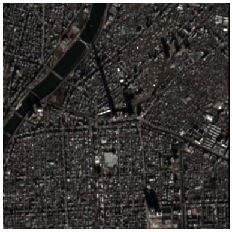

# Observing the analemma via satellite imagery

This repo contains Jupyter Notebooks examples for downloading Sentinel-2 satellite imagery for 
observing the effects of the analemma.

The images from the notebooks were used in the following medium post: LINK

Here is the sketch of the analemma

And here are some time-lapse animations of the analemma

| | |
| ------------- | ------------- |
|   |   |
|   |   |

